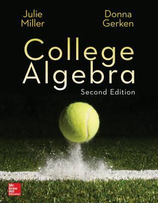

<link href="https://media.uwex.edu/app/droplets_v3/css/droplets.css" rel="stylesheet"/>

## Math 109-05

Fall 2023
MWThF 10:00-10:50 pm HHH 320
Textbook: College Algebra, Secolnd Edition, by Julie Miller and Donna Gerken

&nbsp;

## Instructor
Mckenzie West
Preferred Names: Prof. West, Dr. West
Pronouns: She/Her/Hers
Office: HHH 524
E-mail: [westmr@uwec.edu](mailto:westmr@uwec.edu)

&nbsp;

## Drop-in Hours: 
### What are Drop-in Hours?
This is your opportunity for you to get your questions answered. These are guaranteed times where I will be somewhere to provide you with support.
### Who should attend Drop-in Hours?
Everyone. Whether you have a question or not, attending drop-in hours is good. You can especially think of the Wednesday and Friday sessions as study halls, times and places specifically set aside for Math 109 work to be done.
### When and where are Drop-in Hours?

  
&nbsp;

  

    <h3>Drop-in Hours</h3>
    

    <ul>
    <li>Mondays 1-2pm in HHH 524</li>
    <li>Wednesdays 9-10am in HHH 321 </li>
    <li>Fridays 11am-12pm in HHH 301</li>
    <li>By appointment - best for those who have more private concerns such as grades or attendance.</li>
    </ul>
    

  

&nbsp;

## Math Lab
Can't make it to Drop-in Hours or have questions outside of that time? You are able to get tutoring through the UWEC Math Lab, located on the second floor of Centennial Hall.

[Here's a link to Math Lab information](https://people.uwec.edu/swansoac/MathLabInfo.html) including a map, student work schedule, hours, and a little more information.

&nbsp;

## Equity and Inclusion
A major component of this course is group discussion. I ask that you recognize that all of your classmates have different mathematical backgrounds and experiences. Respect one another; give everyone a space to answer a question, to ask a question, to have an idea, and to be wrong.

&nbsp;

## Course Description
In this course we will cover algebraic concepts, techniques, and applications. Specific topics include polynomial and rational expressions, linear and quadratic equations, complex numbers, inequalities, absolute value, functions and graphs, exponential and logarithmic functions, systems of equations and inequalities, and zeros of polynomials. This course is intended for students pursuing degree programs that require calculus.

## Course Goals 
After the completion of Math 109, you will be able to
1. recognize and solve equations and inequalities;
2. apply linear and rational equations to solve application problems;
3. analyze graphs of functions and piecewise-defined functions;
4. perform operations on functions and evaluate the difference quotient; 
5. apply algebraic techniques to compose and decompose functions;
6. graph the quadratic equation written in vertex form and write the quadratic equation in vertex form; 
7. solve applications using the quadratic formula;
8. divide polynomials using long division and synthetic division;
9. apply the Rational Zero Theorem and the Fundamental Theorem of Algebra to solve problems;
10. solve polynomial and rational inequalities;
11. identify one-to-one functions and find the inverse of a function;
12. evaluate and graph exponential functions and use exponential functions to compute compound interest;
13. convert between logarithmic functions and exponential functions;
14. apply properties of logarithms to graph logarithmic functions and solve application problems;
15. create and use models for exponential growth and decay to solve application problems.

&nbsp;

  
&nbsp;

  

    <h2>Important Dates</h2>
    

    <ul>
    <li>Last Day to Drop: September 19</li>
    <li>Last day to drop to prerequisite (Math 20): September 26</li>
    <li>Last Day to Withdraw (W on transcript): November 14</li>
    </ul>
    

  

&nbsp;

## Evaluation

  
&nbsp;

  

    <h3> Grading Scheme</h3>
    

    <ul>
    <li>10% - Participation and pre-class assignments</li>
    <li>15% - Homework</li>
    <li>20% - Quizzes</li>
    <li>40% - Midterm Exams (4 of them)</li>
    <li>15% - Final Exam</li>
    </ul>
    

  

### Participation and pre-class assignments
Everyday you will be expected to complete a short pre-class assignment that will be graded for completion, and during class, you will be required to complete the day's worksheet.

You may miss up to 5 days before your grade is affected. 
Your score for this component will be the percentage of days with completed pre-class assignments and participation, allowing for up to those 5 missed days.

### Homework
Homework assignments will be due two class days after the content for the assignment was completed. Most assignments will be completed using WeBWorK, an online homework system. Some will require completion of written homework. Due dates and links to assignments will be available on Canvas.

The lowest 3 homework scores will automatically be dropped from the grade calculation. These drops are intended for emergencies and other obligations. Do not skip assignments for the sake of skipping them then expect that later emergencies can be accommodated.

Late assignments will not be accepted.

### Quizzes
Quizzes will happen weekly on Wednesdays, on weeks where there are no exams. The material for each quiz will be the content covered in the previous week of class.

The lowest 2 quiz scores will automatically be dropped from the grade calculation. These drops are intended for emergencies and other obligations. Do not skip quizzes for the sake of skipping them then expect that later emergencies can be accommodated.

### Midterm Exams
There will be an exam after each of Chapters 1-4. Tentative exam dates are:

  
&nbsp;

  

    <h3> Tentative Midterm Exam Dates</h3>
    

    <ul>
    <li>Chapter 1 - Monday 9/25</li>
    <li>Chapter 2 - Friday 10/20</li>
    <li>Chapter 3 - Friday 11/17</li>
    <li>Chapter 4 - Wednesday 12/13</li>
    </ul>
    

  

If you are going to miss an exam, you MUST contact me in advance. See the university <a href="https://www.uwec.edu/kb/article/class-attendance-and-authorized-absence-policies/">authorized absence policy</a> for the list of authorized absences. 

In the case of an illness, it is best to notify me before the exam that you will not be able to attend.

### Final Exam 
The cumulative final exam will take place at a to be determined time, as scheduled by the registrar.

&nbsp;

## Students Co-Enrolled in Math 50
If your enrollment in this class requires you to also be enrolled in Math 50, then 30% of your Math 50 grade will be determined by the following <b>academic skill agreement</b> with me: 

* Every Monday your overall grade in the course will be examined. If it drops below 80%, then you must attend Drop-in Hours that week.
* If you score below a 75% on an exam, then you must meet with me to review your exam.

&nbsp;

## Liberal Education Core
The Liberal Education Core is designed to assist you to develop the skills, knowledge and values needed to engage with highly diverse communities in a global society. Through the liberal education core, UWEC hopes to foster in you the ability to think with intellectual rigor, creativity, and independence, to develop your ability to integrate and apply knowledge, and to empower you to act as a humane, thoughtful leader in the community, the workplace, and the world of ideas. By beginning with the liberal education core and working toward its learning outcomes, we seek to help you establish a strong, broad foundation around which you will build a rich baccalaureate program. (See https://www.uwec.edu/ULEC/Liberal-Education-Framework-Learning-Outcome-and-Rubrics.htm).

This course helps students meet the following Liberal Education Learning Outcome:

  
&nbsp;

  

    

    <b>S2:</b> Use mathematical, computational, statistical, or formal reasoning to solve problems, draw inferences, or determine the validity of stated claims.  
    The skills needed to meet the outcome will be addressed through lectures, homework, and in-class group work activities. You will demonstrate your progress of the LE outcome on the comprehensive final exam.
    

  

&nbsp;

## Technology
Students are encouraged not to engage in disruptive use of technology. The use of calculators or mathematical software will be allowed for most homework exercises. You are absolutely not to use resources such as Chegg and StackExchange for homework help or answers. DO NOT GOOGLE THE ANSWERS!

## PhotoMath and ChatGPT
You are expected to complete assignment on your own without the use of AI tools. The use of these programs will significantly limit your actual learning in the course. The purpose of the homework is to learn how to do the mathematics so that on the quizzes and exams you will do well.

&nbsp;

## Health and Safety
This class will adhere to UWEC COVID-19 policies and guidelines as found here [HTTPS://WWW.UWEC.EDU/CORONAVIRUS-UPDATES/](HTTPS://WWW.UWEC.EDU/CORONAVIRUS-UPDATES/). Each of us shares responsibility for the health and safety of all in the classroom environment.

If you are sick, please stay home and get notes from your classmates. Do not expect that the days lecture will be recorded.

&nbsp;

## Collaboration
You are expected to work together on homework sets, though everyone is required to write up and submit their own solutions, unless otherwise stated. Solutions that appear to be direct copies of a classmate’s or of ones found online will require a one-on-one meeting with me to discuss the source and next steps.

&nbsp;

## Make-up Policies
You are expected to get your homework to Canvas by the deadline each week. If for some reason, you cannot meet that deadline, please get in touch with me, so that we can discuss proper arrangements.
Due to the nature of specifications grading, you will be expected to turn in repeated attempts at assignments on subsequent Wednesdays.

&nbsp;

## Resources
* **SERVICES FOR STUDENTS WITH DISABILITIES** - Any student who has a disability and is in need of classroom accommodations should contact the instructor and the Services for Students with Disabilities Office in Centennial Hall 2106 at the beginning of the semester. [HTTPS://WWW.UWEC.EDU/EQUITY-DIVERSITY-INCLUSION/EDI-SERVICES-PROGRAMS/SERVICES-FOR-STUDENTS-WITH-DISABILITIES/](HTTPS://WWW.UWEC.EDU/EQUITY-DIVERSITY-INCLUSION/EDI-SERVICES-PROGRAMS/SERVICES-FOR-STUDENTS-WITH-DISABILITIES/)
*	**UWEC COUNSELING SERVICES** – A place on campus where you can find someone to talk to when you're feeling hopeless, lonely, depressed, confused, upset over a relationship, or just plain stressed. Call for an appointment: (715) 836-5521.

&nbsp;

## Accessibility
If you are in need of accommodations, please speak with me before/after class or in my office as soon as possible so that we can make arrangements that suit your needs.

&nbsp;

## Mandated Reporting
As a Wisconsin State employee, I am obligated to report any claims of sexual harassment or sexual assault. Please know that any such information revealed to me will be forwarded to the Dean of Students. The Dean of Students office may reach out to you to offer resources and support. If you wish to disclose this information to a confidential resource, you may speak to someone in the Center for Awareness of Sexual Assault, Counseling Services, or Student Health Services.

&nbsp;

## Academic Conduct
I ask that you only submit your own work in order to ensure that you are indeed the one learning the material and meeting the objectives. The disciplinary procedures and penalties for academic misconduct are described on the UW-Eau Claire Dean of Students web site: [HTTPS://WWW.UWEC.EDU/KB/ARTICLE/BLUGOLD-STUDENT-CONDUCT-CODE/](HTTPS://WWW.UWEC.EDU/KB/ARTICLE/BLUGOLD-STUDENT-CONDUCT-CODE/).

&nbsp;

## Course Notes
**Do Not Post Class Notes Online** – *This includes posting homework assignments to sites like Chegg.* 
I do not consent to having notes from my class uploaded to the internet, including commercial note-selling websites such as StudySoup. Some companies target students and solicit course material acting as if they are working in coordination with colleges and universities, but that is not true for this class. This means that you do not have the right to provide your notes to anyone else or to make any commercial use of them without express prior permission from me. Unless you are a qualified disabled student, you do not have the right to record my lectures. Inappropriate use of notes may be in violation of the Blugold Conduct Code and sanctions will be pursued accordingly.

